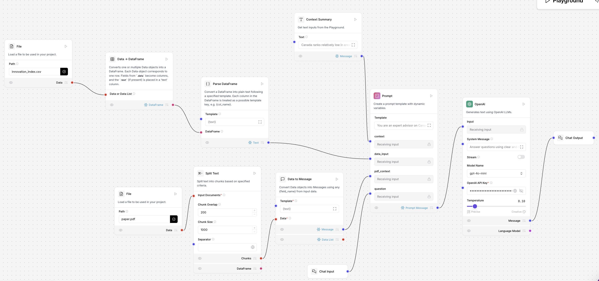

# Data-Driven Analysis of Canada's Innovation Strategy

## Overview

This project analyzes Canada's innovation performance using the Global Innovation Index (GII) dataset and machine learning techniques to identify the key factors influencing national innovation performance.

To make the analytical results more accessible, an AI-powered chatbot was developed using Langflow and the OpenAI API, allowing users to explore Canada's innovation strengths, weaknesses, and policy recommendations through natural language conversations.

This project was completed as a team-based graduate course project for the Master of Engineering in Data Analytics and Machine Learning program at the University of Toronto.

---

## Project Objectives

- Analyze Canada's innovation performance using Global Innovation Index indicators.
- Compare multiple machine learning models to identify the best predictive approach.
- Identify the most influential innovation drivers through feature importance analysis.
- Build an LLM-powered chatbot capable of answering innovation-related policy questions using structured datasets and supporting documents.

---

## Tech Stack

| Category | Technologies |
|-----------|--------------|
| Programming | Python |
| Data Analysis | Pandas, NumPy |
| Machine Learning | Scikit-learn, XGBoost |
| Visualization | Matplotlib |
| LLM | OpenAI API |
| Workflow | Langflow |

---

## Machine Learning Pipeline

```text
Global Innovation Index Dataset
                │
                ▼
      Data Cleaning & Preparation
                │
                ▼
       Feature Engineering
                │
                ▼
      Machine Learning Models
                │
                ▼
      Model Performance Evaluation
                │
                ▼
      Feature Importance Analysis
                │
                ▼
      Policy Recommendations
                │
                ▼
      Langflow AI Chatbot
```

---

## Machine Learning Models

The following supervised learning models were evaluated:

- Linear Regression
- Lasso Regression
- Random Forest
- XGBoost

Model performance was compared using:

- Mean Absolute Error (MAE)
- Root Mean Squared Error (RMSE)
- R² Score

---

## AI Chatbot

A chatbot prototype was developed using **Langflow** and the **OpenAI API** to make the analytical results interactive.

The chatbot combines:

- Global Innovation Index dataset
- Supporting policy documents
- Prompt Engineering
- Context-aware question answering

Example questions include:

- What are Canada's strengths in innovation?
- Why does Canada perform poorly in high-tech manufacturing?
- Which indicators contribute most to Canada's innovation ranking?
- What policy recommendations could improve Canada's innovation performance?

### Langflow Workflow



---

## Key Contributions

- Developed a Langflow-based chatbot prototype using OpenAI API.
- Built and evaluated multiple machine learning models using Global Innovation Index data.
- Applied prompt engineering to generate context-aware responses from structured datasets and policy documents.

---

## Skills Demonstrated

- Data Cleaning & Preparation
- Exploratory Data Analysis (EDA)
- Machine Learning
- Feature Engineering
- Model Evaluation
- Prompt Engineering
- Langflow
- OpenAI API
- Business Analytics
- Data Storytelling

---

## Future Improvements

Potential future enhancements include:

- Deploying the chatbot as a web application using Streamlit.
- Incorporating Retrieval-Augmented Generation (RAG) for improved document retrieval.
- Adding SHAP-based model explainability.
- Expanding the chatbot to support multiple countries and comparative innovation analysis.
